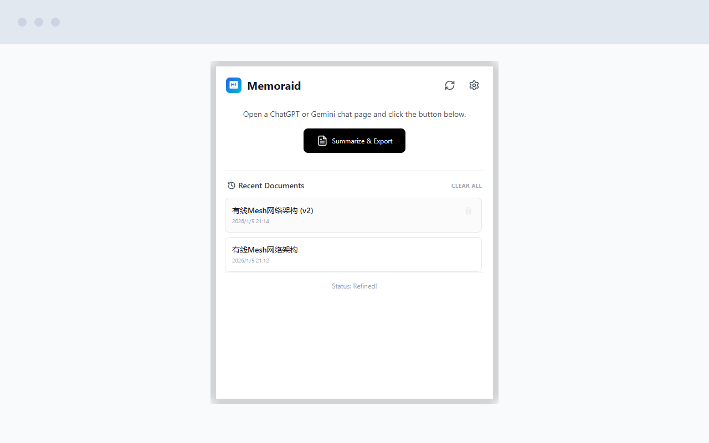
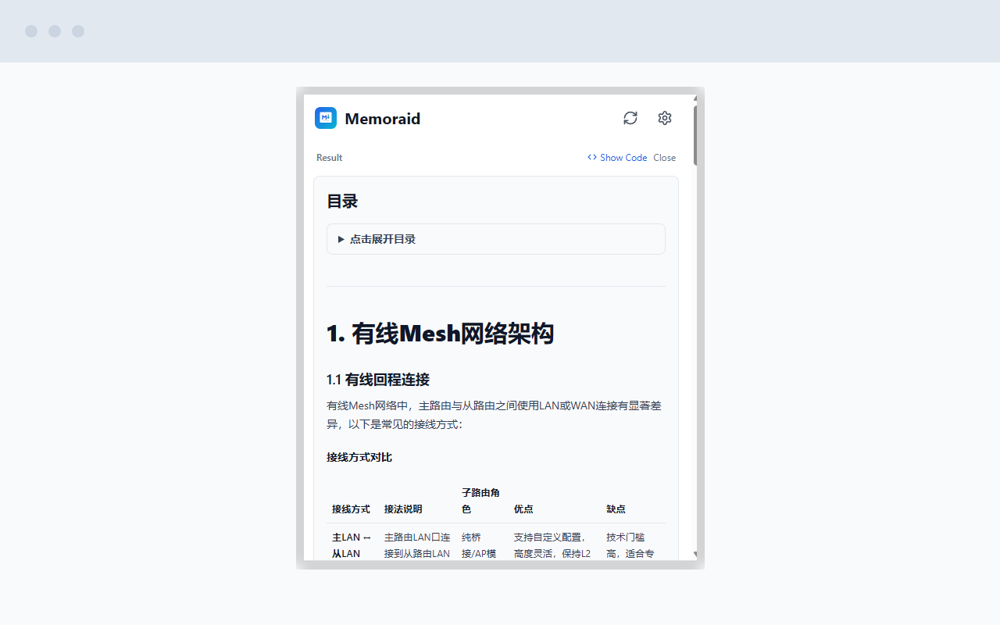
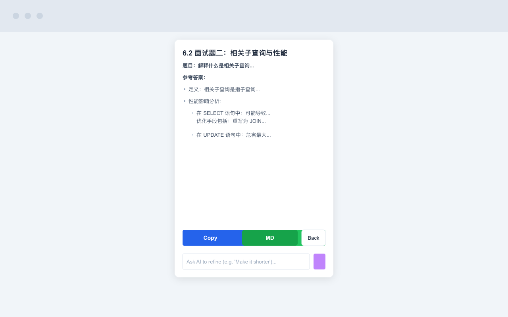
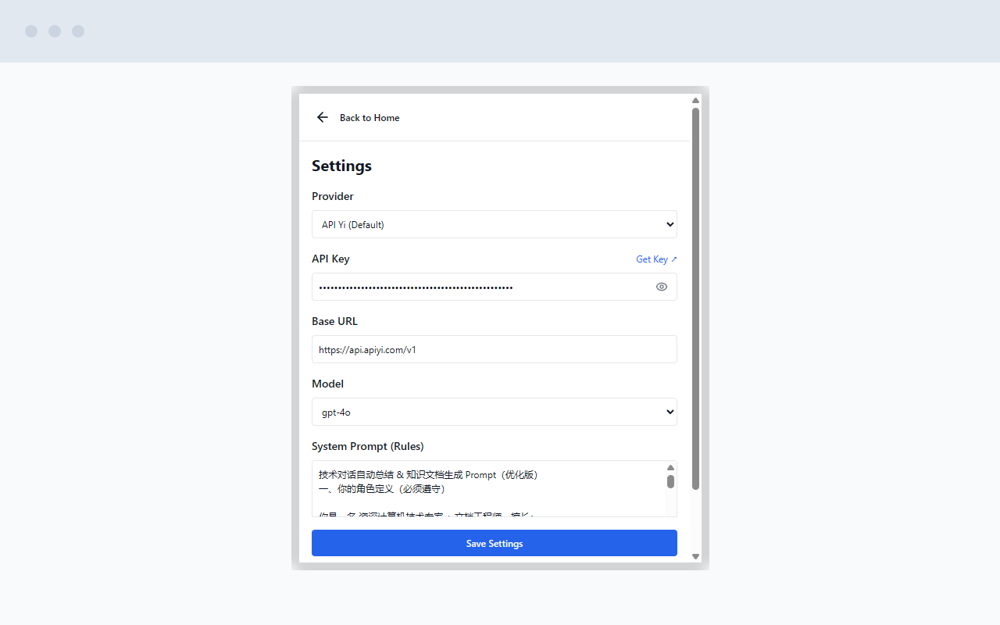

# Memoraid

一个强大的 Chrome 扩展程序，使用 AI（ChatGPT 和 Gemini）来**总结**、**导出**和**优化**对话内容以及**任意网页**。

<div align="center">
  
</div>

## ✨ 核心功能

- **🚀 一键总结**：自动提取 ChatGPT、Gemini、DeepSeek 当前标签页的对话内容，或**任意网页（博客、新闻等）的正文内容**。
- **🌐 全网支持**：内置 Mozilla Readability 引擎，智能识别网页核心内容，去除广告干扰，支持阅读模式总结。
- **🤖 AI 驱动**：使用先进的 LLM（通过 01.AI/Yi、OpenAI、DeepSeek 等）生成简洁、结构化的摘要。
- **💬 对话优化**：针对摘要或原始内容向 AI 提出后续问题（例如，“精简一点”、“翻译成西班牙语”）。
- **📜 历史记录管理**：自动将摘要保存到本地。随时访问过去的导出记录。
- **📝 Markdown 导出**：预览、复制或将摘要下载为干净的 `.md` 文件。
- **🔌 多提供商支持**：支持多个 AI 提供商，包括 **API Yi (01.AI)**、**OpenAI**、**DeepSeek**、**Moonshot** 以及自定义的 OpenAI 兼容接口。
- **📊 Mermaid 图表**：自动在摘要预览中渲染 Mermaid 图表。

## 🖼️ 截图展示

### 1. 主界面与历史记录
查看最近的导出记录并开始新的总结任务。


### 2. AI 总结结果
带有语法高亮的 Markdown 预览。


### 3. 优化对话
提出后续问题并配置您的 API 提供商。


### 4. API配置


## 🛠️ 安装指南

### 从源码安装（开发者模式）

1. **克隆仓库**：
   ```bash
   git clone https://github.com/yourusername/memoraid.git
   cd memoraid
   ```

2. **安装依赖**：
   ```bash
   npm install
   ```

3. **构建扩展**：
   ```bash
   npm run build
   ```

4. **在 Chrome 中加载**：
   - 打开 Chrome 并访问 `chrome://extensions/`。
   - 在右上角启用 **"开发者模式"**。
   - 点击 **"加载已解压的扩展程序"**。
   - 选择第 3 步中生成的 `dist` 文件夹。

## ⚙️ 配置说明

在使用 Memoraid 之前，您需要配置一个 AI 提供商：

1. 点击浏览器工具栏中的 **Memoraid** 图标。
2. 点击右上角的 **设置 (齿轮)** 图标。
3. 选择您偏好的 **提供商 (Provider)**（例如 API Yi, OpenAI, DeepSeek）。
4. 点击 **"Get Key ↗"** 注册/登录并获取您的 API Key。
5. 输入您的 **API Key**。
6. （可选）自定义 **系统提示词 (System Prompt)** 以更改 AI 总结内容的方式。
7. 点击 **"Save Settings"** 保存设置。

## 🚀 使用教程

1. **打开页面**：
   - 导航到 [ChatGPT](https://chatgpt.com)、[Gemini](https://gemini.google.com) 或 [DeepSeek](https://chat.deepseek.com) 的对话页面。
   - 或者打开任意**博客、新闻文章**或技术文档页面。
2. **启动 Memoraid**：点击扩展图标。
3. **开始总结**：点击 **"Summarize & Export"** 按钮。
   - 扩展程序将提取对话内容并发送给 AI。
   - 您可以看到实时的进度和日志（例如，“Waiting for AI response... (12s)”）。
4. **查看与导出**：
   - 完成后，将显示摘要。
   - 点击 **"Copy"** 复制 Markdown 原文。
   - 点击 **"MD"** 下载为文件。
5. **优化内容**：
   - 使用底部的聊天框提出修改要求（例如，“关注技术细节”）。
   - AI 将根据完整的上下文更新摘要。

## 🔒 隐私政策

Memoraid 在设计时充分考虑了隐私：
- **本地存储**：您的 API Key 和聊天历史记录仅存储在您的浏览器本地 (`chrome.storage.local`)。
- **直接 API 调用**：扩展程序直接从您的浏览器与 AI 提供商的 API 通信。不经过任何中间服务器。
- **权限**：仅请求运行所需的必要权限（`activeTab`, `storage` 等）。

## 📄 许可证

MIT License. 详见 [LICENSE](./LICENSE) 文件。
